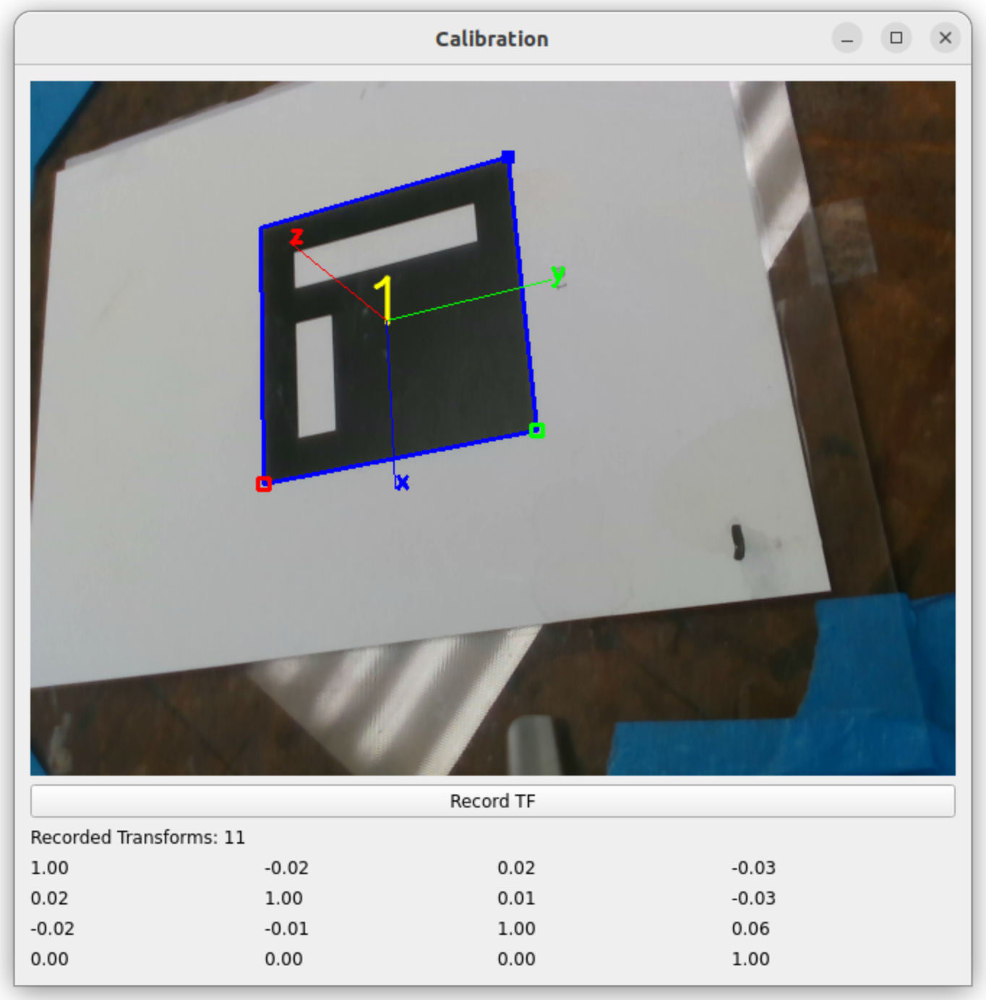

# SAWS Hand-Eye Calibration Package

This package provides the necessary tools for performing hand-eye calibration using ArUco markers with a UR5 robot and a RealSense camera. The package includes launch files, configuration files, and Python nodes for running the calibration process.

## Index

- [Introduction](#introduction)
- [Index](#index)
- [User Guide](#user-guide)
  - [Downloading the Package](#downloading-the-package)
  - [Building the Package](#building-the-package)
  - [Running the Launch Files](#running-the-launch-files)
- [Directory Structure](#directory-structure)
- [File Roles](#file-roles)
  - [launch/handeye_calibration.launch.py](#launchhandeye_calibration.launch.py)
  - [package.xml](#package.xml)
  - [resource/saws_handeye_calibration](#resourcesaws_handeye_calibration)
  - [saws_handeye_calibration/**init**.py](#saws_handeye_calibration__init__.py)
  - [saws_handeye_calibration/axbsolver.py](#saws_handeye_calibrationaxbsolver.py)
  - [saws_handeye_calibration/calibration_node.py](#saws_handeye_calibrationcalibration_node.py)
  - [setup.cfg](#setup.cfg)
  - [setup.py](#setup.py)
- [Summary](#summary)

## User Guide

### Downloading the Package

To download the package, clone the repository using the following command:

```
git clone https://github.com/jhu-rsp/Smart-Automated-Warehouse-System.git
```

### Building the Package

Navigate to the root directory of the package and run the following commands:

```
colcon build --packages-select saws_handeye_calibration
source install/setup.bash
```

### Running the Launch Files

To start the calibration process, execute the following launch file using the ROS 2 launch system:

```
ros2 launch saws_handeye_calibration handeye_calibration.launch.py
```

Use joystick for moving the various joints of the UR5 to get different transformation positions. For more information, refer to the README in the `saws_teleop_joy` package.




## Directory Structure

```
saws_handeye_calibration/
├── launch/
│   ├── handeye_calibration.launch.py
├── package.xml
├── resource/
│   ├── saws_handeye_calibration
├── saws_handeye_calibration/
│   ├── __init__.py
│   ├── axbsolver.py
│   ├── calibration_node.py
├── setup.cfg
├── setup.py
```

## File Roles

### launch/handeye_calibration.launch.py

**Purpose:**

- Launches the necessary nodes for hand-eye calibration including teleoperation, RealSense camera node, ArUco marker detection, and the calibration node.

**Usage:**

- This launch file can be used to start the calibration process. It initializes the necessary ROS nodes and sets up the environment for calibration.
- Run with:
  ```bash
  ros2 launch saws_handeye_calibration handeye_calibration.launch.py
  ```

### package.xml

**Purpose:**

- Defines the package metadata including the name, version, description, maintainer, license, build dependencies, and execution dependencies.

### resource/saws_handeye_calibration

**Purpose:**

- Marker file for ament resource index. It indicates the presence of the `saws_handeye_calibration` package.

### saws_handeye_calibration/axbsolver.py

**Purpose:**

- Provides the `AXBsolver` class for solving the AX=XB problem, which is fundamental to hand-eye calibration.

**Class: AXBsolver**

**Methods:**

- `__init__(self, e_bh, e_sc)`: Initializes the AXBsolver with base-hand and sensor-camera transformations.
- `quat2rotm(self, quat)`: Converts a quaternion to a rotation matrix.
- `axxb(self)`: Solves the AX=XB problem and returns the transformation matrix X.
- `solve_rx(self, alphas, betas)`: Solves for the rotation matrix Rx.
- `solve_tx(self, RA, tA, RB, tB, RX)`: Solves for the translation vector tx.

**Usage:**

- This class is used within the calibration process to compute the transformation matrix required for hand-eye calibration.

### saws_handeye_calibration/calibration_node.py

**Purpose:**

- Defines the `Calibration` node which integrates ROS 2 with a PyQt5 GUI to display images and record transformations between the camera, marker, base, and tool frames.

**Class: Calibration**

**Methods:**

- `__init__(self)`: Initializes the Calibration node, sets up subscriptions, transform listeners, and the GUI.
- `image_callback(self, msg)`: Callback function for image subscription. Converts ROS image messages to OpenCV images.
- `record_tf(self)`: Records the current transformations between camera-marker and base-tool frames.
- `display_transform_matrix(self)`: Calculates and displays the transformation matrix after recording sufficient transforms.
- `transform_to_array(self, transform)`: Converts a TransformStamped object to a list [x, y, z, qx, qy, qz, qw].
- `update_matrix_display(self, matrix)`: Updates the GUI to display the transformation matrix.
- `update_gui(self)`: Updates the GUI with the latest image from the camera.
- `ros_spin_once(self)`: Spins the ROS 2 node once to handle callbacks.
- `spin(self)`: Starts the Qt event loop.

**Usage:**

- This node can be run to perform the hand-eye calibration process. It integrates with the ROS 2 system and provides a GUI for user interaction.

### setup.cfg

**Purpose:**

- Configuration file for setting up the Python package installation.

**Usage:**

- Used by setuptools during the package installation process.

### setup.py

**Purpose:**

- Setup script for the Python package. Defines the package name, version, modules, data files, dependencies, and entry points.

## Summary

The `saws_handeye_calibration` package provides a complete setup for performing hand-eye calibration using ArUco markers. The package includes necessary launch files, configuration files, and Python nodes to run the calibration process efficiently. By following the instructions in this README, users can set up and execute the calibration process for the SAWS project.
